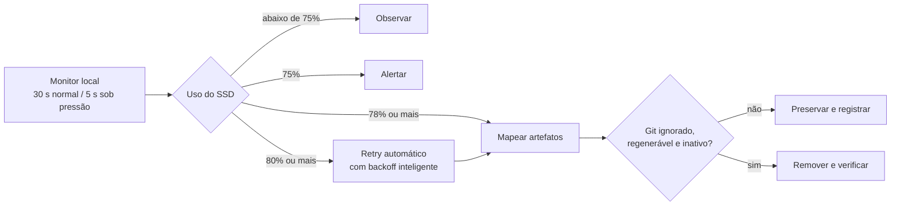

<p align="center">
  
</p>

<h1 align="center">AI, Leave My Mac Alone!</h1>

<p align="center">
  <strong>Proteção autônoma de SSD para quem constrói com IA.</strong><br>
  Feito para o rastro técnico deixado por Codex, Claude Code e agentes de programação.
</p>

<p align="center">
  <a href="https://luisroquette.github.io/ai-leave-my-mac-alone/"></a>
  <a href="https://github.com/luisroquette/ai-leave-my-mac-alone/releases/tag/v2.0.1"></a>
  <a href="https://github.com/luisroquette/ai-leave-my-mac-alone/actions/workflows/ci.yml"></a>
</p>

<p align="center">
  <a href="https://luisroquette.github.io/ai-leave-my-mac-alone/"></a>
</p>

## Sua IA termina a tarefa. Os gigabytes ficam.

Agentes trabalham em paralelo, criam worktrees, instalam dependências e repetem
builds. Depois da entrega, `node_modules`, `.next` e caches de ferramentas
continuam ocupando o SSD. O problema costuma aparecer tarde: a próxima build
falha, uma atualização para ou o macOS fica sem espaço de trabalho.

AI, Leave My Mac Alone! monitora o volume de dados a cada 30 segundos e acelera para 5
segundos sob pressão, sem interromper o fluxo:

| 75% | 78% | 80% | 95% |
|:---:|:---:|:---:|:---:|
| **Alerta** | **Limpeza autônoma** | **Limite protegido** | **Pressão crítica** |
| Um aviso claro | Lista segura | Retry a cada 15 s | Proteções continuam ativas |

<p align="center">
  
</p>

## Uma categoria feita para fluxos com IA

CCleaner e utilitários genéricos fazem manutenção ampla do sistema. AI, Leave My Mac Alone!
entende projetos de software: Git, worktrees, processos ativos, builds e caches
regeneráveis. O foco não é “limpar o Mac”; é impedir que agentes de código
consumam silenciosamente todo o SSD.

- **Autônomo:** inicia com a sessão e verifica o disco a cada 5 segundos acima de 75%.
- **Um clique:** `Limpar agora` executa a mesma política segura sob demanda.
- **Local:** nenhum dado, caminho ou evento sai do computador.
- **Auditável:** código, regras e log de cada execução são públicos ou locais.

## Como a decisão funciona



O percentual usado pela política é o mesmo número arredondado mostrado na
interface. Se o aplicativo exibe **80%**, o retry de proteção já está ativo.

## Contrato de segurança

| Pode remover | Nunca remove |
|---|---|
| Caches de npm, uv, Bun, Deno e Homebrew | Documentos, Mesa, Downloads e mídia pessoal |
| `node_modules` e `.next` com 100 MB ou mais | Fontes rastreadas ou conteúdo não ignorado pelo Git |
| Artefatos ignorados dentro de um repositório Git | Projetos usados por qualquer processo do utilizador |
| Somente após verificar Git e processos novamente | Lixeira, Docker, credenciais e discos externos não selecionados |

A inspeção de processos falha de forma fechada: se o macOS não permitir
confirmar que um projeto está inativo, o alvo é preservado. O Git é comparado
antes e depois da remoção. Falhas e recriações entram no resultado da execução.

> O teto de 80% é **best-effort**, mas nunca é tratado como concluído enquanto o
> disco continuar acima dele. O aplicativo repete a limpeza a cada 15 segundos,
> amplia a tentativa para caches nativos e mantém dados pessoais e projetos ativos protegidos.

## Destino da limpeza

Abra **Mais opções → Preferências** e escolha:

| Destino | Comportamento |
|---|---|
| **Mover para a Lixeira** | Mantém o lote recuperável; o espaço só retorna quando a Lixeira for esvaziada |
| **Lixeira + apagar o lote do app** | Apaga somente o novo lote do AI, Leave My Mac Alone!; itens antigos da Lixeira ficam intocados |
| **Backup em HD externo + apagar do Mac** | Copia e valida cada artefato; depois move o original para um lote exclusivo e apaga somente esse lote |

O backup externo aceita somente uma pasta gravável em um volume não interno. Se
o disco for desconectado, estiver cheio, a cópia divergir ou a exclusão falhar,
o original permanece recuperável e a execução falha de forma fechada.

## O que mudou na v2.0.1

- O alívio de memória agora enxerga órfãos paginados pro swap: alvo de build/dev com 2h+ de uptime é encerrado mesmo com RSS baixo (antes, o filtro de 1GB ficava cego exatamente sob pressão de swap — incidente real de 14/09/2026 com swap a 96% e 1.278 disparos sem efeito).
- Órfãos de telemetria do Next.js (`detached-flush.js`) são encerrados sempre.
- VM Docker (colima) ociosa é desligada com `colima stop` gracioso — apenas com `docker ps` comprovadamente vazio; com container ativo, permanece ligada.
- Decisão de alvo extraída para política pura no Core, coberta por testes de regressão do incidente.

## O que mudou na v2.0.0

- Renomeado de "Clean My Mac" para "AI, Leave My Mac Alone!" — identificador de pacote, log e módulos internos permanecem estáveis para não perder configurações já concedidas no macOS.
- Novo alívio automático e manual de memória: encerra builds Next.js/tsc/webpack/vite/turbo/vitest órfãos que estouram RAM/swap, com a mesma blindagem de segurança da limpeza de disco (nunca toca processos fora da lista de alvos).
- Painel redesenhado: régua com marcas nos limiares reais de política (75/78/80% disco, 75/90% swap) em vez de texto solto, números monoespaçados e seções com fio em vez de cards genéricos.

## O que mudou na v1.2.5

- Acima de 80%, a limpeza volta a tentar a cada 15 segundos mesmo quando a rodada anterior não liberou espaço.
- Se os artefatos não bastarem, a mesma rodada avança para os caches nativos; o Bun usa um diretório controlado e falhas entram no resultado.
- `.next` e `node_modules` inativos em worktrees de projeto dentro de `.claude` entram na lista segura; `~/.claude` continua protegido.

## Instalação

1. Abra a [página oficial de download](https://luisroquette.github.io/ai-leave-my-mac-alone/#download).
2. Preencha nome, WhatsApp e e-mail para liberar o ZIP gratuito.
3. Mova **AI, Leave My Mac Alone!.app** para `Aplicativos`.
4. Na primeira execução, rode:

```bash
xattr -dr com.apple.quarantine "/Applications/AI, Leave My Mac Alone!.app"
open "/Applications/AI, Leave My Mac Alone!.app"
```

O build atual requer **macOS 14+**, processador **Apple silicon** e usa assinatura
ad-hoc. Ainda não há notarização Apple.

## Uso

1. Procure o ícone de disco na barra superior do macOS, perto do Wi-Fi e relógio.
2. Mantenha **Limpeza automática** ativada.
3. Mantenha **Abrir ao iniciar sessão** ativado.
4. Use **Verificar agora** ou **Limpar agora** para uma execução imediata.

O log fica em:

```text
~/Library/Logs/CleanMyMac/clean-my-mac.log
```

[Assistir à demonstração real de 12 segundos](docs/video/clean-my-mac-demo.mp4)

## Arquitetura pequena e nativa

| Componente | Responsabilidade |
|---|---|
| `StorageMonitor` | Amostragem, notificações, login e orquestração |
| `StoragePolicy` | Limites, cooldown normal e retry emergencial |
| `SafeCleaner` | Candidatos, processos, Git, remoção e auditoria |
| `MenuBarView` | Interface SwiftUI na barra do macOS |

Swift 6, SwiftUI, AppKit, ServiceManagement e UserNotifications. Nenhuma
dependência de runtime, Electron, conta ou serviço de nuvem.

Detalhes de separação de módulos e do modelo de segurança em
[`docs/ARCHITECTURE.md`](docs/ARCHITECTURE.md).

## Compilar e verificar

```bash
git clone https://github.com/luisroquette/ai-leave-my-mac-alone.git
cd ai-leave-my-mac-alone
./Scripts/preflight.sh
open "dist/AI, Leave My Mac Alone!.app"
```

O preflight canônico executa validação do `Info.plist`, testes do modelo web,
E2E desktop/mobile, testes Swift, build de produção, verificação da versão
pública e assinatura do aplicativo.

## Escopo de projetos

A busca de artefatos cobre `~/Projects`, `~/Projetos`, `~/Developer`, `~/Code` e
pastas diretas da home que contenham `.git` ou `package.json`. Áreas pessoais do
macOS e caminhos protegidos são excluídos antes da varredura. Worktrees de projeto
dentro de `.claude` são atravessados somente para encontrar `.next` e `node_modules`
ignorados pelo Git, grandes e sem processo ativo.

## Privacidade

Amostras de armazenamento, preferências e logs permanecem no Mac. O aplicativo
não contém cliente de rede, analytics, telemetria, conta ou backend remoto.

## Limitações conhecidas

- O teto de 80% depende da existência de artefatos seguros; enquanto estiver acima,
  o app continua tentando e mantém o uso o mais próximo possível sem apagar trabalho ativo.
- O modo Lixeira não devolve espaço ao SSD até o usuário esvaziá-la.
- Projetos fora das raízes documentadas não são varridos.
- Caches só são limpos quando a respectiva ferramenta está instalada.
- O build distribuído é exclusivo para Apple silicon e ainda não é notarizado.
- A interface atual está em português do Brasil.

## Projeto aberto

[MIT](LICENSE) © 2026 [Luis Roquette](https://github.com/luisroquette).

AI, Leave My Mac Alone! é um software independente. Não possui afiliação, patrocínio ou
endosso da MacPaw. “CleanMyMac” é marca de seu respectivo proprietário.
